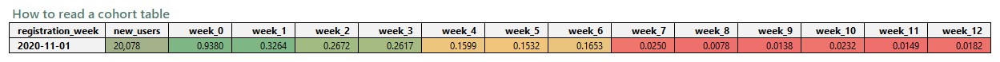
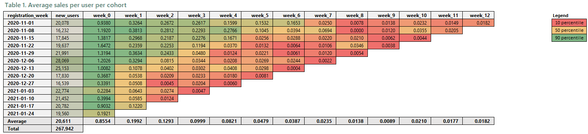
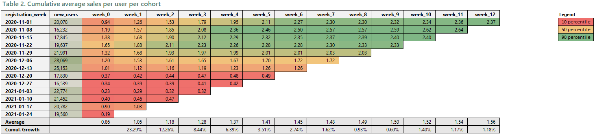
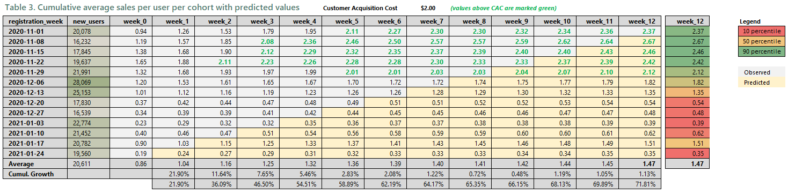

# Customer Lifetime Value (CLV) Analysis


*An analysis of customer lifetime value using SQL to create weekly user cohorts and Excel to visualize retention, cumulative revenue growth, and forecasted profitability over time.*


## 🎯 Business Problem & Objectives

Understanding the initial value of a customer is important, but knowing their long-term value is critical for sustainable growth. Businesses often struggle to look beyond the first transaction to see how much revenue a customer cohort generates over its entire lifecycle. This project was designed to solve that problem.

The primary objectives were:

* **Measure Customer Lifetime Value (CLV):** Calculate the cumulative average sales generated by a user over the first 12 weeks of their lifecycle.
* **Analyze User Retention & Engagement:** Understand how quickly a new user cohort starts spending and how that spending behavior changes over time.
* **Compare Cohort Quality:** Identify which user acquisition periods (i.e., weekly cohorts) produced the most valuable customers in the long run.
* **Forecast Profitability:** Predict the future CLV of a cohort and compare it against the Customer Acquisition Cost (CAC) to determine when a customer becomes profitable.


## ⭐ Project Overview

This project provides a detailed analysis of customer lifetime value by grouping users into weekly cohorts based on their registration date. The core of the analysis was performed in SQL to process transaction data and calculate weekly sales per user. The final tables and predictions were then created in Excel to visualize three key aspects of customer value:

1.  **Average Sales Per User:** A retention table showing the average weekly spend for each cohort.
2.  **Cumulative CLV:** A cumulative table that sums the average weekly sales over time, providing a clear view of how the lifetime value of each cohort grows.
3.  **Forecasted Profitability:** A predictive table that forecasts the future CLV of each cohort and compares it against a set Customer Acquisition Cost (CAC) to identify the break-even point.


## 📌 How to read a cohort table

Before we look at actual findings, it is important to understand the structure of cohort tables and how to read them properly.



From left to right, here’s what you’re looking at:

- **registration week - 2020-11-01**: This is the weekly "cohort" - a time period which we use to segment our customers (based on registration date) and measure key performance indicators.
- **new users - 20,078**: This is the number of new users comming to our website. So 20,078 new users appeared in our website in a week starting at 2020-11-01.
- **week_0 - 0.9380**: This is the average dollar value of sales that a user, within 2020-11-01 cohort, generated in initial cohort week (week_0). Calculated by dividing Total Sales generated in initial week by number of users within cohort (20,078).
- **week_1 - 0.3264**: This is the average dollar value of sales that a user, within 2020-11-01 cohort, generated in following week after week_0 (week_1). Calculated by dividing Total Sales generated in the following week (week_1: 2020-11-08) by number of users within cohort (20,078).

Each new cohort has one fewer column to account for fewer weeks passing from their initial cohort week to the present day (reference day).


## 💡 Key Insights & Findings

The analysis of the cohort tables revealed several critical insights into customer behavior and value.



#### 1. Acquisition Peaks in Early December
* **Insight:** User acquisition varied significantly week-to-week. The week of **2020-12-06** was the top-performing period, acquiring **28,069 new users** - a **73% increase** compared to the lowest-performing week.
* **Recommendation:** Investigate the marketing campaigns, promotions, or seasonal events that drove the acquisition spike in early December. Replicating these successful conditions can lead to more efficient user growth.

#### 2. The First Purchase is the Most Significant
* **Insight:** The highest average sales per user occurs in "**Week 0**", the week of their registration. In fact, the average sales in this initial week are greater than the sum of the average sales over the next 12 weeks combined, indicating a steep drop-off in repeat purchases.
* **Recommendation:** Implement targeted re-engagement campaigns and incentives to encourage a second purchase. The data clearly shows that converting a one-time buyer into a repeat customer is a major opportunity for revenue growth.




#### 3. The First Three Weeks are Critical for Value Generation

* **Insight:** The vast majority of a customer's initial value is generated within the first three weeks of their lifecycle. The cumulative growth table shows a steep increase in this period, with the highest week-over-week growth (**23.3%**) occurring in the first week.
* **Recommendation:** Focus marketing and onboarding efforts heavily on a new user's first 21 days. This is the prime window to run welcome offers and educational campaigns to maximize initial spending.
  
#### 4. Customer Value Growth Plateaus After Week 4

* **Insight:** After the initial surge, the growth in cumulative customer value slows significantly. By week 5, the weekly growth in CLV drops to around 3.5% and continues to decline.
* **Recommendation:** Implement re-engagement campaigns targeted at customers between 4 and 6 weeks old. This is the critical period to prevent churn and encourage the next purchase before their activity flatlines.



#### 5. Predicting Profitability: CLV vs. CAC

* **Insight:** By forecasting future CLV based on historical growth patterns, we can determine when a cohort becomes profitable. With a Customer Acquisition Cost (CAC) of **$2.00**, high-value cohorts (like the one from 2020-11-08) are predicted to become profitable as early as **Week 3**.
* **Recommendation:** This predictive model is a powerful tool for strategic marketing investment. It allows the business to allocate budget towards channels that acquire users similar to those in historically high-performing cohorts, ensuring a faster and more reliable return on ad spend.

---

## 🗄️ Methodology

While a traditional CLV calculation provides a single, high-level average, it hides crucial details about customer behavior over time.

> **`CLV = (Average Purchase Value) x (Purchase Frequency) x (Customer Lifetime)`**

For this analysis, a more sophisticated **cohort-based approach** was chosen because it provides far more actionable insights. Instead of one static number, cohort analysis creates a "movie" of customer value, revealing how different groups of customers behave and spend throughout their lifecycle. This method allows us to:

* **Identify Trends:** See if customer retention is improving or declining over time.
* **Compare Acquisition Quality:** Determine which marketing campaigns or time periods brought in more valuable customers.
* **Create Accurate Forecasts:** Use the behavior of older cohorts to predict the future value of new ones.

The analysis was conducted using a three-step process:

1.  **Cohort Creation & Weekly Sales Calculation (SQL):** The first step involved writing a SQL query to group all users into cohorts based on their registration week and calculate the *average sales per user* for each cohort in each week.

2.  **Cumulative Value Calculation (Excel):** The resulting table from the SQL query was imported into Excel. A second table was then created to calculate the **cumulative average sales per user**, showing the growing lifetime value for each cohort.

3.  **Forecasting Future CLV (Excel):** A predictive model was built in Excel based on the historical cumulative growth rates. This model was used to forecast the future CLV for cohorts with incomplete data and to pinpoint the week in which each cohort's CLV was expected to surpass the Customer Acquisition Cost (CAC).

### SQL Code

```sql
WITH
-- 'ETL' prep on raw_events table.
modified_raw_events AS (
    SELECT
        DATE(FORMAT_DATE('%Y-%m-%d', PARSE_DATE('%Y%m%d', event_date))) AS event_date,
        user_pseudo_id,
        purchase_revenue_in_usd
    FROM `tc-da-1.turing_data_analytics.raw_events`
    WHERE
        DATE(FORMAT_DATE('%Y-%m-%d', PARSE_DATE('%Y%m%d', event_date))) < '2021-01-31'
),

-- Find the registration week for each user
user_registration AS (
    SELECT
        user_pseudo_id,
        MIN(DATE_TRUNC(event_date, WEEK)) AS registration_week
    FROM modified_raw_events
    GROUP BY 1
),

-- Calculate the week number for each event relative to the user's registration
event_with_week_number AS (
    SELECT
        reg.registration_week,
        events.user_pseudo_id,
        events.purchase_revenue_in_usd,
        DATE_DIFF(DATE_TRUNC(events.event_date, WEEK), reg.registration_week, WEEK) AS week_number
    FROM modified_raw_events AS events
    JOIN user_registration AS reg
      ON events.user_pseudo_id = reg.user_pseudo_id
),

-- Calculate total revenue per cohort per week
weekly_cohort_revenue AS (
    SELECT
        registration_week,
        week_number,
        SUM(purchase_revenue_in_usd) AS total_revenue
    FROM event_with_week_number
    GROUP BY 1, 2
),

-- Count the number of new users in each cohort
cohort_size AS (
    SELECT
        registration_week,
        COUNT(DISTINCT user_pseudo_id) AS new_users
    FROM user_registration
    GROUP BY 1
),

-- Final calculation: average sales per user for each cohort and week (long format)
final_long_data AS (
    SELECT
        rev.registration_week,
        size.new_users,
        rev.week_number,
        rev.total_revenue / size.new_users AS avg_sales_per_user
    FROM weekly_cohort_revenue AS rev
    JOIN cohort_size AS size
      ON rev.registration_week = size.registration_week
)

-- Final step: Pivot the long data into a wide cohort table
SELECT
    registration_week,
    new_users,
    MAX(IF(week_number = 0, avg_sales_per_user, NULL)) AS week_0,
    MAX(IF(week_number = 1, avg_sales_per_user, NULL)) AS week_1,
    MAX(IF(week_number = 2, avg_sales_per_user, NULL)) AS week_2,
    MAX(IF(week_number = 3, avg_sales_per_user, NULL)) AS week_3,
    MAX(IF(week_number = 4, avg_sales_per_user, NULL)) AS week_4,
    MAX(IF(week_number = 5, avg_sales_per_user, NULL)) AS week_5,
    MAX(IF(week_number = 6, avg_sales_per_user, NULL)) AS week_6,
    MAX(IF(week_number = 7, avg_sales_per_user, NULL)) AS week_7,
    MAX(IF(week_number = 8, avg_sales_per_user, NULL)) AS week_8,
    MAX(IF(week_number = 9, avg_sales_per_user, NULL)) AS week_9,
    MAX(IF(week_number = 10, avg_sales_per_user, NULL)) AS week_10,
    MAX(IF(week_number = 11, avg_sales_per_user, NULL)) AS week_11,
    MAX(IF(week_number = 12, avg_sales_per_user, NULL)) AS week_12
FROM final_long_data
GROUP BY
    registration_week,
    new_users
ORDER BY
    registration_week;

```

---

## 🚀 Future Improvements
This analysis provides a strong foundational understanding of overall customer lifetime value. The next step to make this data even more actionable is to move from an aggregate view to a segmented one.

- **Segmented CLV Analysis**: The model could be expanded to calculate CLV for different customer segments. This would allow us to answer critical business questions like:

  - "How does the CLV of customers acquired from the 'Black Friday' campaign compare to those from the 'Holiday' campaign?"

  - "Do customers from a specific country or who buy a certain product type have a higher lifetime value?"

- **CLV as a Performance Metric**: By segmenting CLV, it can become a core KPI for measuring the effectiveness of virtually any business effort. This would help the company double down on what works and abandon what doesn’t, optimizing for long-term profitability.

## ⚠️ Limitations

- **Dependency on Historical Data**: The entire analysis and its forecasts are based on past customer behavior. This model assumes that future customers will behave similarly to past customers. If the business makes significant changes (e.g., new products, different marketing strategies) or if market conditions change, these historical patterns may no longer be accurate predictors of the future.

- **Short Customer Lifecycle View**: The analysis is limited to the first 12 weeks of a customer's lifecycle. While this is great for understanding initial value and short-term retention, it doesn't capture the full "lifetime" of a customer, which could span months or years. Long-term churn and repeat purchase behavior are not fully visible.

- **Doesn't Account for Costs**: This analysis focuses on revenue-based CLV. A more complete profitability analysis would also incorporate the Cost of Goods Sold (COGS) and other variable costs to calculate the actual profit generated by each customer cohort.

- **Aggregate View**: While cohort analysis is powerful, it still looks at the average user within a cohort. It doesn't account for the fact that a few high-spending "whales" might be skewing the average for the entire group.